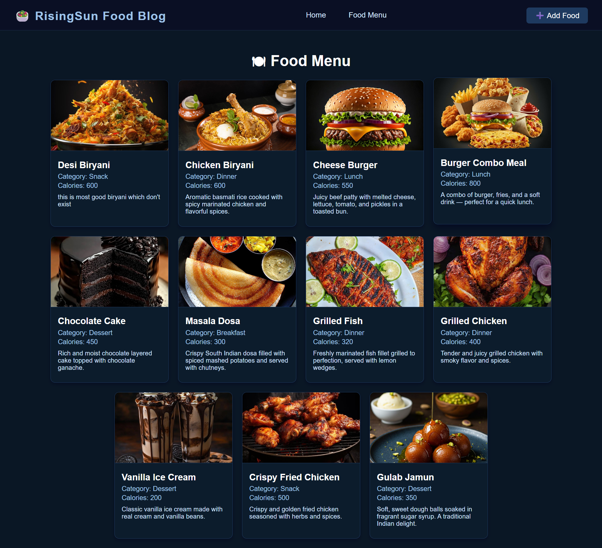

# 🍽️ RisingSun Food Blog App

Welcome to the **RisingSun Food Blog App**, a simple and clean web application built while learning the basics of **Next.js**! This project is my first step into server-side rendering and working with MongoDB in a full-stack environment.

---

## 🚀 Project Overview

This app allows users to:

- 🌐 View a beautiful **Home Page**
- 📜 Explore a dynamic **Food Menu Page** where food data is fetched from **MongoDB**
- ➕ Add their own food entries via the **Add Food Page** (currently in progress)

I built this to understand routing, data fetching, and JSX component structuring in Next.js. More features and styling will be added as the project grows.

---

## 🛠️ Tech Stack

- **Framework**: [Next.js](https://nextjs.org/)
- **Database**: [MongoDB](https://www.mongodb.com/)
- **Styling**: Plain CSS
- **Frontend**: React & JSX components

---

## 📸 Screenshots

---
